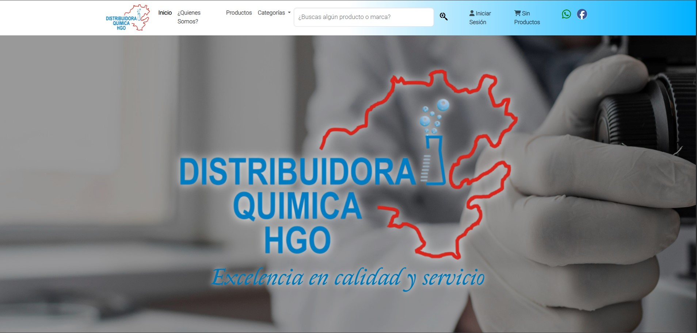
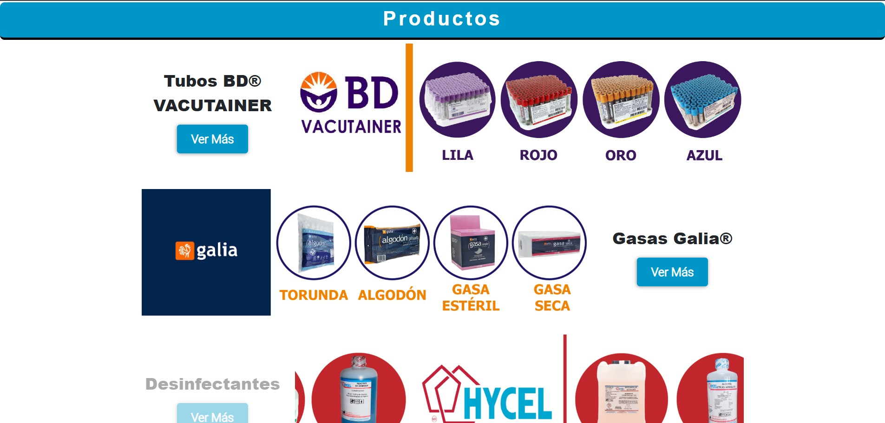
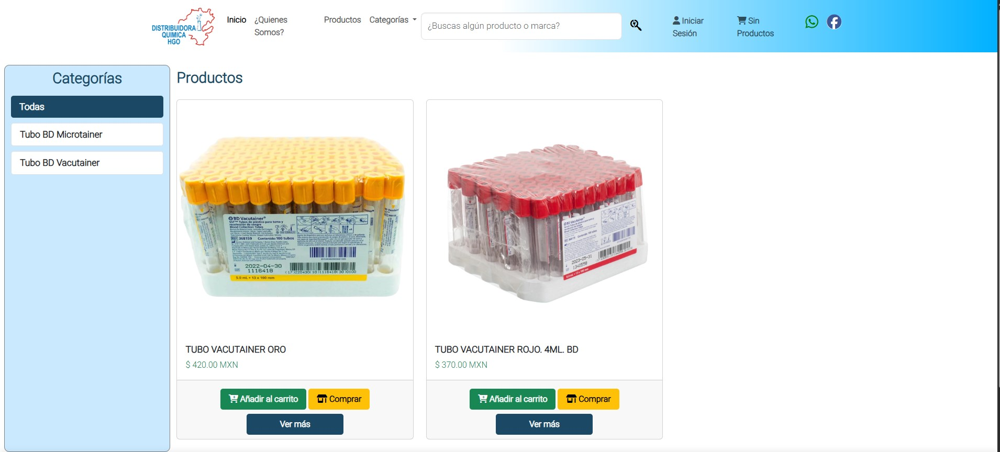
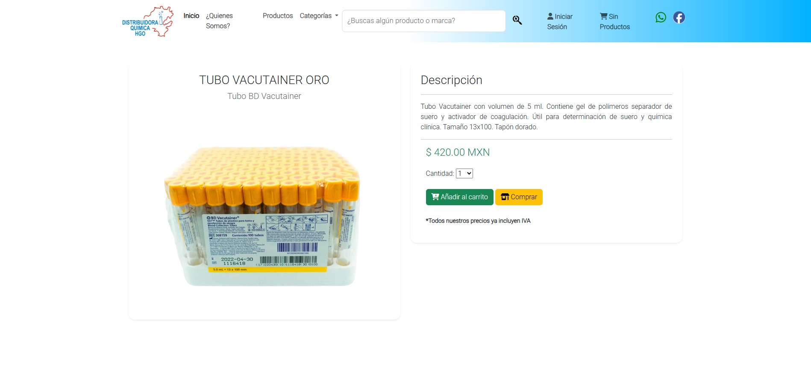
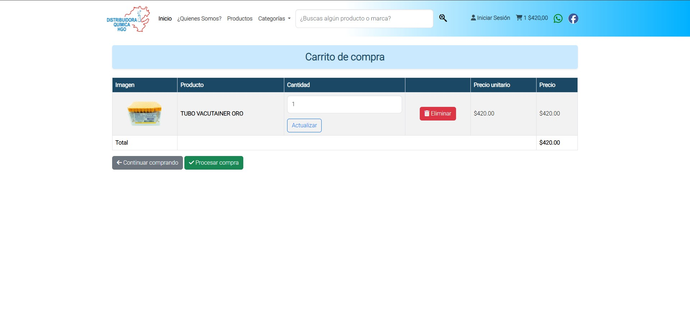
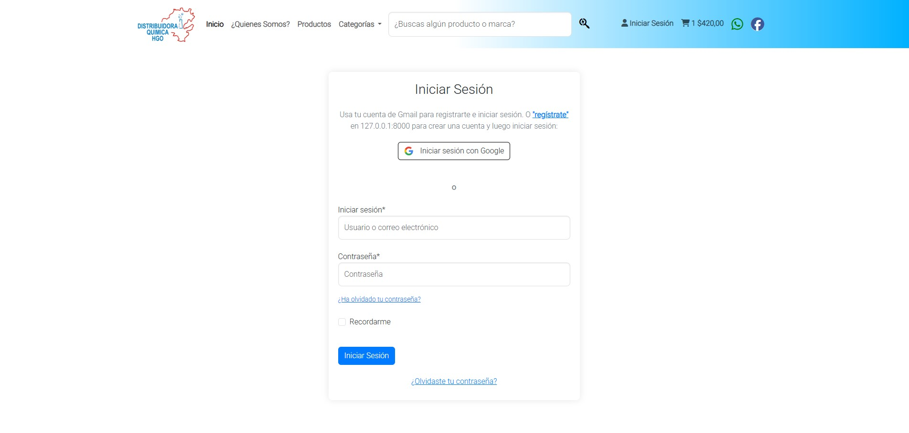

# 🛒 DistribuidoraHGO

Aplicación web desarrollada con **Django 4.2** y **Bootstrap 4** para la gestión de un e-commerce sencillo.  
Incluye módulos de tienda, carrito de compras y órdenes, con integración de login/registro mediante **Google OAuth** y soporte para despliegue en la nube.

---

## 🚀 Características principales

- 🔐 Autenticación de usuarios con **Django-Allauth** (correo y Google).
- 🛍️ Módulos incluidos:
  - `website` → Páginas principales e información.
  - `store` → Gestión de productos.
  - `cart` → Carrito de compras.
  - `orders` → Gestión de órdenes.
- 🎨 Formularios con **Crispy Forms + Bootstrap 4**.
- ☁️ Almacenamiento de archivos e imágenes con **Cloudinary**.
- 🌐 Middleware configurado para **CORS** y despliegue en **Heroku/Render**.
- 📦 Manejo de estáticos con **Whitenoise**.
- 🐬 Base de datos **MySQL** (con soporte opcional a JawsDB en producción).
- 🌍 Idioma configurado a **Español (es-ES)**.

---

